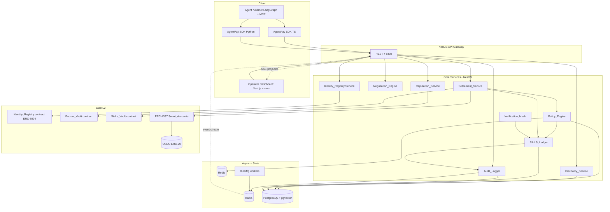
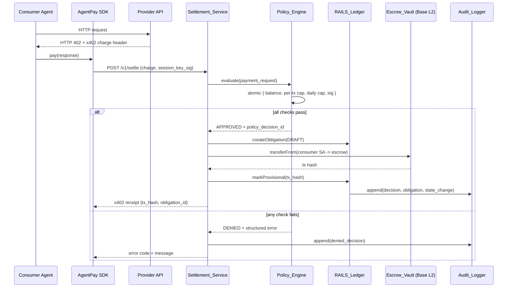
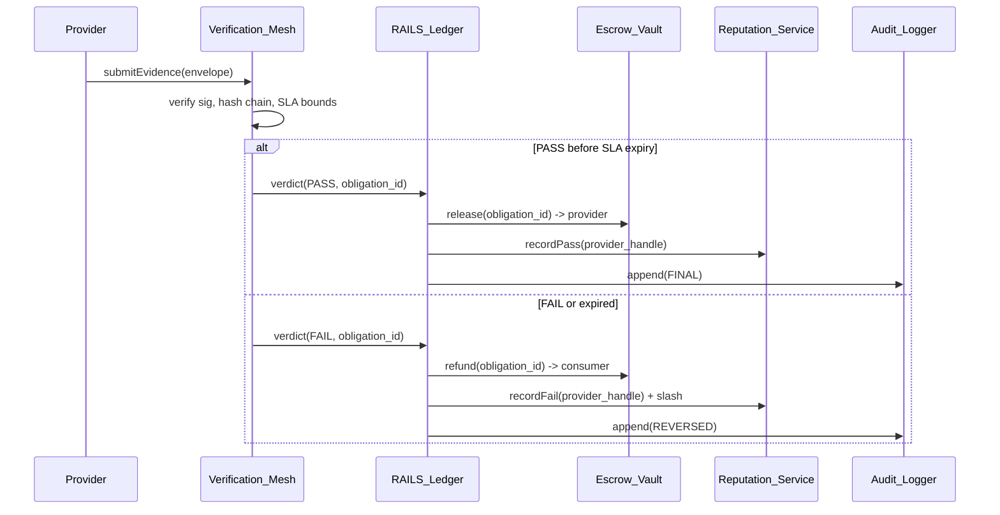
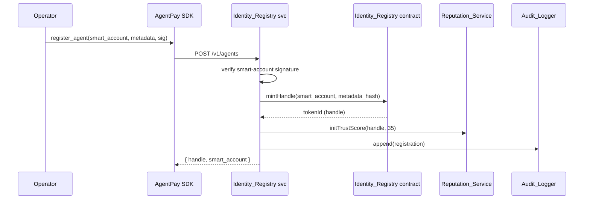
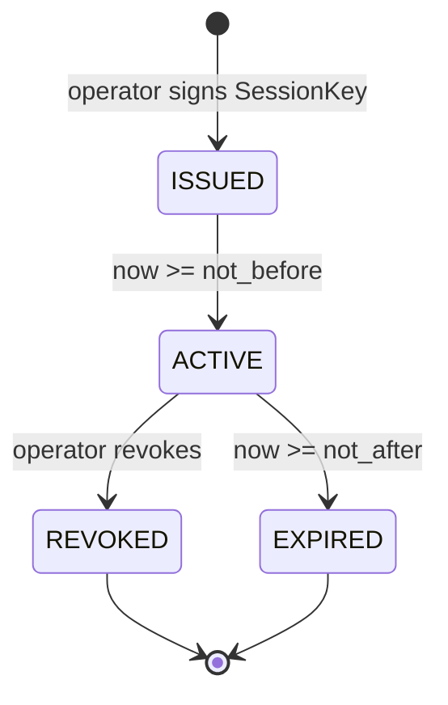
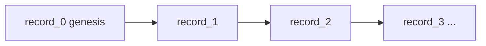

# Design Document

## Overview

AgentPay is a financial operating system for autonomous agents. It exposes a six-layer protocol stack (Identity, Discovery, Negotiation, Settlement, Verification, Reputation) backed by an infrastructure-level Policy Engine, a RAILS clearing framework, and Glass Box audit logging.

This design realises the full vision specified in `requirements.md` while drawing a clear MVP-vs-post-MVP boundary so the platform can be built incrementally. The architecture follows three principles:

1. **Out-of-band guardrails.** The Policy Engine sits on the payment data path and cannot be bypassed by the agent's control plane. Every payment request is gated by a single atomic decision.
2. **Deterministic, signable records.** Obligation Objects, Evidence Envelopes, and Audit records use canonical JSON so they can be hashed, signed, and round-tripped without ambiguity.
3. **Layered finality.** Funds move through DRAFT → PROVISIONAL → FINAL/REVERSED states tied to on-chain confirmations and verification verdicts; humans can intervene at named points without breaking the state machine.

### MVP vs Post-MVP scope

| Requirement | Scope | Notes |
|---|---|---|
| R1 Agent Identity Registration | MVP | ERC-8004 mint via Identity_Registry contract on Base L2 testnet. |
| R2 Discovery | Post-MVP | pgvector index, OpenAPI ingest. Stub `discover_agents` returns empty list in MVP. |
| R3 Negotiation/SLA | Post-MVP | RFQ flow + signed SLA. MVP uses a static `SLA` template attached to a known provider. |
| R4 x402 Settlement | MVP | USDC on Base L2, Smart Account → Escrow_Vault. |
| R5 Verification | Post-MVP | Log attestation in v1, TEE attestation in v2. |
| R6 Reputation/Staking | Post-MVP | Trust_Score initialised in MVP (R1), updates/slashing later. |
| R7 Policy Engine | MVP | Atomic balance/cap/cap/signature check. |
| R8 Policy Configuration | MVP | CRUD + rolling 24-hour spend. |
| R9 RAILS Finality | MVP (partial) | DRAFT/PROVISIONAL transitions in MVP; FINAL/REVERSED gated on verification land in v2. |
| R10 Glass Box Audit | MVP (partial) | Hash-chained log in MVP; oversight intervention points post-MVP. |
| R11 SDK | MVP | TypeScript SDK first, Python SDK alongside MVP launch. |
| R12 Canonical JSON | MVP | Required for signing Obligation/Evidence from day one. |
| R13 Session Keys | MVP | Issuance, expiry, revocation, bounds. |
| Operator Dashboard (read-model) | MVP slice | Wallet connect, agent discovery (stub backend in MVP), my-agents, obligations list, audit log viewer, policy editor, session-key manager. |
| Operator Dashboard (reputation history, oversight reviewer UI) | Post-MVP | Charts, reviewer workqueue; depend on Reputation_Service and oversight intervention being live. |

The MVP slice (R1, R4, R7, R8, R9 partial, R10 partial, R11, R12, R13, plus the dashboard MVP slice) delivers end-to-end agent payments under enforced policy with auditable records and a first-class UI surface over them. Subsequent slices add discovery, negotiation, verification, and reputation behind the same RAILS and Policy contracts.

## Architecture

### Logical architecture

AgentPay is a set of services connected by Kafka (for audit and state-change events), Redis (for rate counters and session-key caches), and PostgreSQL with pgvector (for durable state and embeddings). The on-chain layer is Base L2: ERC-4337 Smart Accounts, an `Escrow_Vault`, the `Identity_Registry` (ERC-8004 over ERC-721), and a `Stake_Vault`.



### Request data path for a payment



### Verification, finality, and refund



### Agent registration



### Session key lifecycle



`ACTIVE → REVOKED` propagates to all Policy_Engine instances within 10 seconds via a Redis pub/sub `session_key.revoked` channel; the persistent revocation record in PostgreSQL is the source of truth on cache miss.

### Glass Box audit chain

Audit records form a hash chain per agent handle. Each record stores `prev_hash`, `payload_hash`, and `record_hash = H(prev_hash || payload_hash || timestamp || actor)`. The chain head per handle is cached in Redis for fast appends and reconciled to PostgreSQL by a BullMQ worker.



## Components and Interfaces

All HTTP APIs are versioned at `/v1`, return JSON, and use structured error envelopes (`{code, message, details}`). All write endpoints require an `Idempotency-Key` header and are stored for 24 hours keyed by `(caller, key)`.

### Identity_Registry Service

Responsible for ERC-8004 handle issuance, lookup, and handle transfer audit. Talks to the on-chain `Identity_Registry` contract.

```
POST   /v1/agents                  body: { smart_account, metadata, signature }
GET    /v1/agents/{handle}
POST   /v1/agents/{handle}/transfer body: { new_smart_account, signature }
GET    /v1/agents/by-account/{addr}
```

Notes:
- Duplicate registration for an existing Smart_Account returns the existing handle without minting.
- Handle metadata is content-addressed: the contract stores `metadata_hash`, full metadata is in PostgreSQL.

### Discovery_Service

Indexes provider OpenAPI schemas and answers semantic search queries.

```
POST   /v1/discovery/providers     body: { handle, openapi_3_1_document }
GET    /v1/discovery/search        query: q, min_trust_score, limit<=50
DELETE /v1/discovery/providers/{handle}
```

Indexing pipeline: OpenAPI 3.1 validate → summarize endpoints → embed (Sentence-Transformers or hosted embedding) → upsert into `discovery_index(handle, vec, trust_score, last_updated)`.

### Negotiation_Engine

Brokers RFQs and produces signed SLAs.

```
POST   /v1/rfq                     body: { provider_handle, task, deadline_ms }
POST   /v1/rfq/{id}/quote          body: { price_usdc, latency_ms, expiry, provider_sig }
POST   /v1/rfq/{id}/accept         body: { consumer_sig }
GET    /v1/sla/{sla_id}
```

SLA is a canonical JSON object signed by both parties. Acceptance is the SLA's "birth" moment; from then on `sla_id` is referenced by Settlement, Verification, and RAILS.

### Settlement_Service

The x402 gateway. Parses charge headers, runs them through the Policy_Engine, performs the on-chain transfer, and writes RAILS state.

```
POST   /v1/settle                  body: { sla_id, x402_header, session_key_sig }
GET    /v1/obligations/{id}
```

Internal flow per request:
1. Parse `x402_header` → `ChargeRequest{amount, asset, recipient, network, nonce}`.
2. Reject if `asset != USDC` or `network != base-mainnet|base-sepolia`.
3. Call `Policy_Engine.evaluate(payment_request)`.
4. On APPROVED: call `RAILS_Ledger.createObligation(DRAFT)`, submit `transferFrom` from Smart Account into `Escrow_Vault` bound to the obligation id, write tx hash, transition DRAFT → PROVISIONAL.
5. Return x402 receipt `{ tx_hash, obligation_id, policy_decision_id }`.

### Verification_Mesh

Validates Evidence Envelopes against the SLA.

```
POST   /v1/verify/evidence         body: EvidenceEnvelope (canonical JSON)
GET    /v1/verify/verdicts/{obligation_id}
```

Verifier types are pluggable: `log_attestation` (v1: signed log digest matches request/response hashes), `tee_attestation` (v2: AMD SEV-SNP or Intel TDX quote validated against configured roots).

### Reputation_Service

Tracks Trust_Score and stake.

```
GET    /v1/reputation/{handle}
POST   /v1/reputation/stake        body: { handle, amount_usdc, signature }
POST   /v1/reputation/stake/withdraw body: { handle, amount_usdc, signature }
```

Trust_Score is bounded [0, 100], initialised at 35. Increments and decrements are configured per platform deployment (`reputation_pass_delta`, `reputation_fail_delta`).

### Policy_Engine

Single source of truth for the atomic gate. Stateless per request; all state in Redis (counters) and PostgreSQL (policies, session keys, revocations).

```
POST   /v1/policy/evaluate         body: PaymentRequest -> Decision
GET    /v1/policy/{smart_account}
PUT    /v1/policy/{smart_account}  body: { per_tx_cap_usdc, daily_cap_usdc }
POST   /v1/policy/session-keys     body: SessionKeyIssuance
DELETE /v1/policy/session-keys/{key_id}
```

`Decision`:
```
{ verdict: "APPROVED" | "DENIED",
  policy_decision_id: string,           // UUIDv7
  reason_code: PolicyErrorCode | null,
  reason_message: string | null,
  evaluated_at: ISO8601,
  inputs_hash: hex }                    // hash of canonical PaymentRequest
```

The four checks are executed inside a Postgres transaction with `SELECT ... FOR UPDATE` on the `(smart_account)` row and an `INCRBY` on the Redis daily-spend counter, then committed; rollback on any check failure leaves no state change.

### Audit_Logger

Append-only hash-chained log.

```
POST   /v1/audit/append            body: AuditEvent (canonical JSON)
GET    /v1/audit/export            query: handle, from, to
GET    /v1/audit/{handle}/head     -> latest record_hash
POST   /v1/audit/oversight/decide  body: { intervention_id, decision: approve|reject, reviewer, sig }
```

Storage rejects UPDATE and DELETE at the database level via a Postgres rule that raises an exception, and the application layer returns `immutable_record` on any mutation attempt.

### RAILS_Ledger

Holds Obligation_Objects, drives finality transitions, and emits terminal events.

```
POST   /v1/rails/obligations       body: ObligationDraftRequest -> { obligation_id, finality_state }
POST   /v1/rails/obligations/{id}/provisional  body: { tx_hash }
POST   /v1/rails/obligations/{id}/verdict      body: { performance: PASS|FAIL, evidence_hash }
GET    /v1/rails/obligations/{id}
```

Finality transitions are guarded by a state-machine check; invalid transitions return `invalid_finality_transition`.

### AgentPay SDK (TypeScript + Python)

Both packages expose the same surface:

```
register_agent({ metadata, signer }) -> { handle, smart_account }
discover_agents({ query, min_trust_score?, limit? }) -> Agent[]
request_quote({ provider_handle, task, deadline_ms }) -> SLA
pay({ http_402_response, session_key }) -> X402Receipt
get_obligation(obligation_id) -> Obligation
set_policy({ smart_account, per_tx_cap_usdc, daily_cap_usdc }) -> Policy
issue_session_key({ bounds, validity_window }) -> SessionKey
revoke_session_key(key_id) -> void
```

Both packages pin exact versions of `viem`/`web3.py`, `noble-curves`/`coincurve`, and a shared `@agentpay/canonical-json` (TS) / `agentpay_canonical_json` (Python) library that implements the canonical JSON spec. The SDK fetches `/v1/meta/version` on first call and emits a single warning if the platform's API version is outside the SDK's supported range.

### Operator Dashboard

A first-party web client that gives consumers an easy way to connect a Smart Account and discover agents, and gives agent owners visibility into their agents' policy state, session keys, obligations, finality progression, audit chain, and reputation. The dashboard is a read-model client over the existing `/v1` APIs plus a thin auth surface; it does not introduce a new core service and is not on the payment data path.

**Architecture placement.** The dashboard is a Next.js 14 (App Router) application using `viem` for wallet interaction and the existing `@agentpay/sdk` for typed API calls. Server components issue API requests through the same NestJS API Gateway as the SDKs; no service-to-service traffic bypasses the gateway. Authentication state is held in a `httpOnly` session cookie carrying a short-lived JWT (15-minute access, 7-day refresh) signed by the Gateway. The dashboard does not custody keys: every signing operation (policy change, session-key issuance, oversight decision) is performed by the user's connected wallet via EIP-712.

**Authentication.** Sign-In With Ethereum (SIWE / EIP-4361) challenge-response. Flow:

1. `POST /v1/auth/challenge` returns a nonce and a SIWE message template bound to `(domain, smart_account, issued_at, expiration_time)`.
2. The dashboard asks the wallet to sign the SIWE message via `personal_sign` or, for ERC-4337 accounts, an EIP-1271 signature.
3. `POST /v1/auth/verify` validates the signature, asserts `expiration_time` not yet passed, and issues `{access_token, refresh_token}` with `sub = smart_account`.
4. All subsequent dashboard requests carry the access token; the Gateway forwards `x-actor-account` to backing services so audit records record the authenticated operator.

**Route and page surface.**

| Route | Audience | Purpose |
|---|---|---|
| `/connect` | All | SIWE wallet connect, network check, account linkage |
| `/discover` | Consumers | Search bar, `min_trust_score` filter, ranked list of provider handles, capability summary, latency/price hints |
| `/agents/{handle}` | All | Provider detail: metadata, OpenAPI summary, Trust_Score, past SLAs, success rate |
| `/my-agents` | Agent owners | List of agents owned by the connected Smart_Account, link to detail pages |
| `/my-agents/{handle}/policy` | Agent owners | View current policy, edit per-tx and daily caps, submit signed update |
| `/my-agents/{handle}/session-keys` | Agent owners | Issue, view, revoke session keys; show ACTIVE/REVOKED/EXPIRED status |
| `/my-agents/{handle}/obligations` | Agent owners (consumer side) | Paginated list of obligations the handle is paying for, finality state, tx hash, evidence hash, link to verdict |
| `/my-agents/{handle}/inbox/rfqs` (post-MVP) | Provider-side agent owners | Incoming RFQs, accept/decline, quote drafting |
| `/my-agents/{handle}/slas` (post-MVP) | Provider-side agent owners | Signed SLAs the handle is party to (consumer or provider), with counterparty, price, expiry, current obligation status |
| `/my-agents/{handle}/evidence` (post-MVP) | Provider-side agent owners | Evidence_Envelope submissions per obligation, verifier verdicts (PASS/FAIL), envelope hash chain, link to finality transition |
| `/my-agents/{handle}/stake` (post-MVP) | Agent owners | Current stake balance, slashing history, stake/withdraw actions (withdraw blocked while open obligations exist, surfaced inline) |
| `/my-agents/{handle}/audit` | Agent owners + compliance | Hash-chained audit log viewer; per-page chain verification badge; CSV/JSON export |
| `/my-agents/{handle}/reputation` (post-MVP) | Agent owners | Trust_Score over time, pass/fail breakdown |
| `/oversight` (post-MVP) | Human reviewers | Pending intervention queue with approve/reject decisions |

**API surface.** The dashboard reuses existing `/v1` endpoints; net-new endpoints are limited to authentication and one paginated read variant of audit export:

```
POST   /v1/auth/challenge          body: { smart_account } -> { nonce, siwe_message, expires_at }
POST   /v1/auth/verify             body: { siwe_message, signature } -> { access_token, refresh_token }
POST   /v1/auth/refresh            body: { refresh_token } -> { access_token }
POST   /v1/auth/logout             body: { refresh_token } -> 204
GET    /v1/audit/export/page       query: handle, from, to, cursor?, limit<=200 -> { records[], next_cursor|null }
```

`/v1/audit/export/page` is a cursor-paginated variant of the existing single-shot `/v1/audit/export`. Cursor is an opaque base64 token encoding `(record_id, record_hash)`; the server returns at most `limit` records and a `next_cursor` if more remain. The single-shot export is preserved for compliance bulk-pull workflows.

All other dashboard data needs are satisfied by existing endpoints: `GET /v1/agents/{handle}`, `GET /v1/agents/by-account/{addr}`, `GET /v1/discovery/search`, `GET /v1/policy/{smart_account}`, `PUT /v1/policy/{smart_account}`, `POST /v1/policy/session-keys`, `DELETE /v1/policy/session-keys/{key_id}`, `GET /v1/obligations/{id}`, `GET /v1/reputation/{handle}`, `POST /v1/audit/oversight/decide`. Provider-side views consume `GET /v1/rfq/{id}` and `GET /v1/sla/{sla_id}` (already defined on `Negotiation_Engine`) and a new read endpoint `GET /v1/verify/verdicts/by-handle/{handle}` (a thin filter over the existing `Verification_Mesh` verdict store) for the evidence/verdict timeline; the underlying state and write paths are unchanged.

**Real-time updates.** The Gateway exposes a Server-Sent Events stream at `GET /v1/dashboard/events?topics=...` authenticated by the same SIWE-issued JWT. The stream is a per-connection projection over the Kafka families defined in ADR-9, scoped to handles the authenticated `smart_account` owns (Property 28 below). The dashboard subscribes to:

- `obligation.transitions` for handles owned by the authenticated operator → push finality-state UI updates (DRAFT → PROVISIONAL → FINAL/REVERSED) without a poll;
- `oversight.decisions` and `audit.events` filtered to `event_type in {oversight_pause, oversight_decision}` → push reviewer-queue updates and pause/resume banners;
- `session_key.revocations` → push session-key status changes within the 10s window already guaranteed by Property 25.

The SSE projector is a thin consumer over Kafka with no business logic; it filters by ownership and forwards the canonical event payload as `data:` lines. There is no service-side state machine introduced. Reconnection uses the standard SSE `Last-Event-ID` header; the projector returns events strictly newer than that id from the consumer's committed offset.

```
GET /v1/dashboard/events           query: topics=obligation.transitions,oversight.decisions,session_key.revocations,audit.events
                                   header: Authorization: Bearer <jwt>
                                   -> text/event-stream of canonical event JSON
```

**Read-model consistency.** The dashboard is a thin read-model over services that already enforce the correctness properties. The view-model layer does not derive new totals: it displays the values returned by `GET /v1/policy/{smart_account}` directly (covered by Property 17), the obligation finality states returned by RAILS (covered by Property 18), the Trust_Score returned by Reputation_Service (covered by Property 12), and the session-key status returned by Policy_Engine (covered by Property 24). Four universally-quantified properties are genuinely new and are introduced for the dashboard surface: Property 26 (audit export pagination equivalence and chain continuity across page boundaries), Property 27 (SIWE authentication binds the JWT subject to the signing Smart_Account), Property 28 (dashboard reads are scoped to handles owned by the authenticated Smart_Account), and Property 29 (real-time event stream emits exactly the finality, oversight, and revocation events for owned handles, in commit order).

**MVP slice vs post-MVP.**

| Capability | Scope | Notes |
|---|---|---|
| SIWE wallet connect, session JWT | MVP | Required for any dashboard action. |
| `/discover` page over `GET /v1/discovery/search` | MVP | In MVP the backend returns a stubbed empty list; the page is functional and ready to light up when R2 ships. |
| `/agents/{handle}` detail | MVP | |
| `/my-agents`, `/my-agents/{handle}/obligations` | MVP | |
| `/my-agents/{handle}/audit` viewer with paginated export and per-page chain verification | MVP | Uses new `/v1/audit/export/page`. |
| `/my-agents/{handle}/policy` editor | MVP | Signed via wallet. |
| `/my-agents/{handle}/session-keys` manager | MVP | Issue, list, revoke. |
| Real-time SSE for finality transitions, oversight, session-key revocations | MVP | `GET /v1/dashboard/events`; ownership-scoped projection. |
| Provider-side RFQ inbox, SLA list, evidence/verdict timeline | Post-MVP | Depends on Negotiation_Engine (R3) and Verification_Mesh (R5). |
| Stake management UI | Post-MVP | Depends on Reputation_Service stake endpoints (R6). |
| `/my-agents/{handle}/reputation` charts | Post-MVP | Depends on Reputation_Service (R6). |
| `/oversight` reviewer queue | Post-MVP | Depends on oversight intervention path (R10.4, R10.5). |

## Data Models

All models are defined in canonical JSON form. Field order, key escaping, number formatting, and unicode normalization are specified in the **Canonical JSON** subsection below.

### Obligation_Object

```
ObligationObject {
  obligation_id: UUIDv7 string,
  sla_id: UUIDv7 string,
  consumer_handle: string,                 // ERC-8004 token id as decimal string
  provider_handle: string,
  consumer_smart_account: 0x-address,
  provider_smart_account: 0x-address,
  amount_usdc: string,                     // integer micro-USDC (6 decimals), no leading zeros, no trailing dot
  asset: "USDC",
  network: "base-mainnet" | "base-sepolia",
  nonce: string,                           // from x402 header
  finality_state: "DRAFT" | "PROVISIONAL" | "FINAL" | "REVERSED",
  policy_decision_id: UUIDv7 string,
  created_at: RFC3339 UTC string,          // exact "Z" suffix
  tx_hash: 0x-hash | null,
  evidence_hash: hex | null,
  schema_version: 1
}
```

Signature: `consumer_sig = sign(canonical_json(ObligationObject without consumer_sig, provider_sig))`, attached alongside as a sibling field in transport but excluded from canonical encoding for the hash.

### Evidence_Envelope

```
EvidenceEnvelope {
  envelope_id: UUIDv7 string,
  obligation_id: UUIDv7 string,
  sla_id: UUIDv7 string,
  request_hash: hex,                       // sha256 of canonical request payload
  response_hash: hex,
  log_attestation: {
    log_digest: hex,
    signer_handle: string,
    signature: hex
  } | null,
  tee_attestation: {
    quote: base64,
    measurement: hex,
    signer_root: string
  } | null,
  observed_latency_ms: integer,
  produced_at: RFC3339 UTC string,
  prev_hash: hex,                          // hash of previous envelope in chain
  envelope_hash: hex,                      // = sha256(canonical_json(this without envelope_hash))
  schema_version: 1
}
```

At least one of `log_attestation` or `tee_attestation` MUST be non-null; both MAY be present.

### SLA

```
SLA {
  sla_id: UUIDv7 string,
  consumer_handle: string,
  provider_handle: string,
  task: {
    description: string,
    inputs_schema_hash: hex,
    outputs_schema_hash: hex
  },
  price_usdc_micro: string,                // integer micro-USDC
  latency_bound_ms: integer,
  success_criteria: "log_attestation" | "tee_attestation",
  expiry: RFC3339 UTC string,
  consumer_signature: hex,
  provider_signature: hex,
  schema_version: 1
}
```

### Policy

```
Policy {
  smart_account: 0x-address,
  per_tx_cap_usdc_micro: string,           // integer
  daily_cap_usdc_micro: string,            // integer
  rolling_24h_spend_usdc_micro: string,    // integer, computed
  updated_at: RFC3339 UTC string,
  schema_version: 1
}
```

### Session_Key

```
SessionKey {
  key_id: UUIDv7 string,
  smart_account: 0x-address,
  public_key: hex,
  not_before: RFC3339 UTC string,
  not_after: RFC3339 UTC string,
  bounds: {
    per_tx_cap_usdc_micro: string,
    cumulative_cap_usdc_micro: string,
    allowed_recipients: [0x-address] | null  // null = unrestricted
  },
  status: "ACTIVE" | "REVOKED" | "EXPIRED",
  issued_at: RFC3339 UTC string,
  revoked_at: RFC3339 UTC string | null,
  schema_version: 1
}
```

### Audit_Record

```
AuditRecord {
  record_id: UUIDv7 string,
  handle: string,
  event_type: "agent_input" | "agent_reasoning" | "agent_output"
            | "policy_decision" | "finality_transition"
            | "oversight_pause" | "oversight_decision"
            | "registration" | "settlement_attempt"
            | "policy_update",
  payload: object,                          // event-specific
  payload_hash: hex,                        // sha256(canonical_json(payload))
  prev_hash: hex,                           // genesis record uses 64 zeros
  record_hash: hex,                         // sha256(prev_hash || payload_hash || timestamp || actor)
  actor: string,                            // operator addr, service id, or "system"
  timestamp: RFC3339 UTC string,
  schema_version: 1
}
```

### Trust_Score

```
TrustScore {
  handle: string,
  score: integer,                           // 0..100
  pass_count: integer,
  fail_count: integer,
  stake_usdc_micro: string,
  updated_at: RFC3339 UTC string,
  schema_version: 1
}
```

### Payment_Request (Policy_Engine input)

```
PaymentRequest {
  smart_account: 0x-address,
  sla_id: UUIDv7 string,
  charge: {
    amount_usdc_micro: string,
    asset: "USDC",
    network: "base-mainnet" | "base-sepolia",
    recipient: 0x-address,
    nonce: string
  },
  session_key_id: UUIDv7 string,
  session_key_signature: hex,
  request_id: UUIDv7 string,
  submitted_at: RFC3339 UTC string,
  schema_version: 1
}
```

### Canonical JSON

The canonical encoding is RFC 8785 (JCS) with two tightening rules to make signing and round-tripping unambiguous:

1. Object keys are sorted lexicographically by UTF-8 code point.
2. Strings are NFC-normalised before escaping.
3. Numbers are emitted as JSON strings whenever they could lose precision in IEEE-754 (all USDC amounts and nonces are strings in the schemas above to enforce this).
4. No insignificant whitespace, no trailing newline.
5. `null` is permitted only where the schema explicitly allows it.

A reference implementation lives in `packages/canonical-json` (TS) and `packages/agentpay_canonical_json` (Python) and is the only allowed encoder for signed records.

### On-chain contracts (Base L2)

Solidity 0.8.24, deployed via deterministic CREATE2 to obtain identical addresses on Base mainnet and Sepolia.

- **Identity_Registry (ERC-8004 over ERC-721).** `mintHandle(address smartAccount, bytes32 metadataHash) returns (uint256 tokenId)`; `transferHandle(uint256 tokenId, address newSmartAccount)`; storage maps `smartAccount -> tokenId` to dedupe registration; emits `HandleMinted` and `HandleTransferred` events.
- **Escrow_Vault.** `lock(bytes32 obligationId, address payer, address payee, uint256 amount)` pulls USDC via `transferFrom`; `release(bytes32 obligationId)` callable only by `RAILS_Settler` role; `refund(bytes32 obligationId)` callable only by `RAILS_Settler` role; storage maps `obligationId -> Escrow{ payer, payee, amount, state }`. State enum `{ NONE, LOCKED, RELEASED, REFUNDED }`. Reentrancy guard on all external calls.
- **Stake_Vault.** `stake(uint256 handle, uint256 amount)`, `requestWithdraw(uint256 handle, uint256 amount)` blocked while `openObligationCount[handle] > 0`, `slash(uint256 handle, uint256 amount, address payee)` callable only by `Reputation_Settler` role.

Role assignments use OpenZeppelin AccessControl. The off-chain `Settlement_Service` and `RAILS_Ledger` share a relayer EOA holding `RAILS_Settler`; key rotation is documented in operations runbook.

### Gas and L2 considerations

USDC transfers on Base L2 cost roughly 0.0001–0.0005 USD per call at current gas; this is the binding constraint on sub-cent payments. The design relies on Base for cheap settlement, but batched settlement (multiple obligations cleared in one tx) is reserved as a post-MVP optimisation, not a v1 requirement.

## Correctness Properties

*A property is a characteristic or behavior that should hold true across all valid executions of a system, essentially a formal statement about what the system should do. Properties serve as the bridge between human-readable specifications and machine-verifiable correctness guarantees.*

The properties below were derived from the prework analysis. Each property is universally quantified, references the requirements it validates, and is the unit of property-based test coverage.

### Property 1: Registration is idempotent and produces a handle with initial trust

*For any* Smart_Account address `a` and metadata `m`, calling `register_agent(a, m)` returns a handle `h` such that subsequent calls `register_agent(a, m')` for any `m'` return the same `h`, the on-chain ERC-721 balance of `a` is exactly 1, and the Trust_Score for `h` immediately after first registration equals 35.

**Validates: Requirements 1.1, 1.2, 1.3**

### Property 2: Handle transfer preserves trust score and audit history

*For any* registered handle `h` with Trust_Score `s` and audit record set `R`, transferring `h` to any new Smart_Account `a'` leaves Trust_Score equal to `s` and the audit record set for `h` a superset of `R` containing exactly one additional transfer record.

**Validates: Requirements 1.5**

### Property 3: Discovery search filters and orders correctly

*For any* discovery index `I`, query `q`, optional `min_trust_score` filter `t`, and limit `n <= 50`, the result `R = search(I, q, t, n)` satisfies: (a) `|R| <= n`, (b) every handle `h` in `R` has `trust_score(h) >= t`, and (c) cosine similarity to `q` is non-increasing along `R`.

**Validates: Requirements 2.2, 2.3**

### Property 4: Discovery deregistration removes entries within the propagation window

*For any* indexed provider `h`, calling `deregister(h)` at time `t` implies that for any query `q` evaluated at time `t' >= t + 60s`, the result does not contain `h`.

**Validates: Requirements 2.5**

### Property 5: SLA signatures verify against canonical bytes

*For any* accepted RFQ producing SLA `s`, both `consumer_signature` and `provider_signature` verify against the canonical JSON encoding of `s` with those two fields excluded, using the public keys recorded on the respective handles; an SLA whose signatures fail this check is rejected and an audit event is emitted.

**Validates: Requirements 3.3, 3.5**

### Property 6: x402 charge header round-trip

*For any* valid x402 charge header `h`, `encode_x402(parse_x402(h)) == h` and `parse_x402(encode_x402(c)) == c` for any well-typed `ChargeRequest` `c`.

**Validates: Requirements 4.1**

### Property 7: Approved charge produces an escrow lock with conserved amount

*For any* Policy_Engine APPROVED decision on `PaymentRequest{amount=A, payer=P, payee=Q, sla=S}` that completes settlement successfully, after the settlement transaction confirms: (a) `Escrow_Vault.lookup(obligation_id).amount == A` with payer `P` and payee `Q`, (b) USDC balance of `P` decreased by exactly `A`, (c) the returned x402 receipt contains the on-chain `tx_hash` and the `obligation_id`, and (d) the Obligation_Object is in state PROVISIONAL.

**Validates: Requirements 4.2, 4.3, 9.1, 9.2**

### Property 8: Unsupported asset or network is rejected before any state change

*For any* charge `c` with `c.asset != "USDC"` or `c.network not in {"base-mainnet", "base-sepolia"}`, `settle(c)` returns an `unsupported_asset` error, no Obligation_Object is created, and no on-chain transaction is submitted.

**Validates: Requirements 4.4**

### Property 9: Verification verdict is a pure function of evidence, SLA, and time

*For any* Evidence_Envelope `e` referencing Obligation_Object `o` under SLA `s`, the emitted verdict `v = verify(e, o, s, now)` is `PASS` iff all hold: (a) `e.envelope_hash` verifies against canonical bytes of `e` excluding `envelope_hash`, (b) `e.prev_hash` equals the previous envelope hash in `o`'s chain, (c) `e.observed_latency_ms <= s.latency_bound_ms`, (d) at least one of `log_attestation` or `tee_attestation` verifies under `s.success_criteria`, and (e) `now <= s.expiry`; otherwise `v = FAIL`. In both cases an audit record is emitted containing the verdict, verifier identity, and `e.envelope_hash`.

**Validates: Requirements 5.1, 5.2, 5.3, 5.4, 5.5**

### Property 10: Trust_Score evolves as clamped arithmetic over verdict sequence

*For any* handle `h` with initial score `s0`, configured increments `+p` for PASS and `-f` for FAIL, and any sequence of verdicts `V`, the resulting Trust_Score equals `clamp(s0 + p*pass_count(V) - f*fail_count(V), 0, 100)`.

**Validates: Requirements 6.1, 6.2**

### Property 11: Slashing conserves USDC across stake and counterparty

*For any* FAIL verdict against handle `h` with stake `S`, counterparty `C`, and configured slash fraction `phi in [0, 1]`, after slashing: (a) new stake is `S - floor(S * phi)`, (b) counterparty `C` USDC balance increases by exactly `floor(S * phi)`, (c) total USDC across stake vault and counterparty is unchanged by the slash transfer.

**Validates: Requirements 6.3**

### Property 12: Reputation query reflects materialised state

*For any* handle `h`, `get_reputation(h)` returns a tuple equal to the materialised `(trust_score, total_count, success_rate)` where `total_count = pass_count + fail_count` and `success_rate = pass_count / total_count` when `total_count > 0` else `null`.

**Validates: Requirements 6.4**

### Property 13: Stake withdrawal is blocked while obligations are open

*For any* handle `h` with `open_obligation_count(h) > 0`, `withdraw_stake(h, any_amount)` returns `pending_obligations` and stake balance is unchanged.

**Validates: Requirements 6.5**

### Property 14: Policy_Engine atomic decision

*For any* PaymentRequest `r`, the Policy_Engine decision satisfies all of: (a) verdict is APPROVED iff balance check, per-transaction cap check, daily cap check, and signature check all pass; (b) when DENIED, the `reason_code` is exactly one of `{per_transaction_cap_exceeded, daily_cap_exceeded, insufficient_balance, signature_invalid, key_expired, key_bounds_exceeded, oversight_rejected}` and reflects the first failing check; (c) when DENIED, the rolling 24-hour spend counter is unchanged and no on-chain transaction is submitted; (d) when APPROVED, the rolling 24-hour spend counter increases by exactly `r.charge.amount_usdc_micro`. Furthermore, no committed on-chain settlement exists without a corresponding APPROVED `policy_decision_id` in the audit log.

**Validates: Requirements 7.1, 7.2, 7.3, 7.4, 7.5, 7.6, 13.4**

### Property 15: Policy updates apply to subsequent requests and a reduced daily cap blocks payments until the window drops

*For any* policy update `U` persisted at time `t`, every PaymentRequest with `submitted_at >= t` is evaluated against `U`; in particular, for any new `daily_cap` `D'` less than the current `rolling_24h_spend` `S`, every subsequent PaymentRequest is DENIED with `daily_cap_exceeded` until `S` (recomputed over the trailing 24 hours) is strictly less than `D'`.

**Validates: Requirements 8.1, 8.2**

### Property 16: Policy update audit record completeness

*For any* persisted policy update transitioning policy from `P_before` to `P_after` by operator `o`, exactly one audit record of type `policy_update` exists whose payload contains `P_before`, `P_after`, and `o`.

**Validates: Requirements 8.3**

### Property 17: Policy query returns consistent computed values

*For any* Smart_Account `a`, `get_policy(a)` returns `(per_tx_cap, daily_cap, rolling_24h_spend, remaining_daily)` where `remaining_daily = max(daily_cap - rolling_24h_spend, 0)` and the four values are consistent with the state used to evaluate the next PaymentRequest.

**Validates: Requirements 8.4**

### Property 18: RAILS finality state machine

*For any* Obligation_Object `o` and any sequence of inputs, the only state transitions that occur are those in the set `{ DRAFT -> PROVISIONAL on tx_confirmed, PROVISIONAL -> FINAL on (perf=PASS AND policy=PASS), PROVISIONAL -> REVERSED on (perf=FAIL OR settlement_revert) }`. Any other attempted transition is rejected with `invalid_finality_transition` and leaves the state unchanged. Whenever `o` enters FINAL or REVERSED, exactly one `finality_transition` audit record is emitted and exactly one balance transfer occurs (release to provider or refund to consumer respectively).

**Validates: Requirements 9.1, 9.2, 9.3, 9.4, 9.5**

### Property 19: Audit log is a hash chain monotone in time

*For any* handle `h` and any two consecutive audit records `r_i`, `r_{i+1}` for `h`, `r_{i+1}.prev_hash == r_i.record_hash`, `r_{i+1}.record_hash == sha256(r_{i+1}.prev_hash || r_{i+1}.payload_hash || r_{i+1}.timestamp || r_{i+1}.actor)`, and `r_{i+1}.timestamp >= r_i.timestamp`. Any update or delete on a persisted record returns `immutable_record` and leaves the log unchanged. Export over `(h, from, to)` returns exactly the records whose timestamps lie in `[from, to]` for `h`, ordered ascending by timestamp.

**Validates: Requirements 10.1, 10.2, 10.3**

### Property 20: Oversight rejection blocks subsequent payments for the SLA

*For any* oversight intervention on SLA `s` where the reviewer issues `reject` at time `t`, every PaymentRequest for `s` submitted at time `t' >= t` is DENIED with `oversight_rejected`.

**Validates: Requirements 10.4, 10.5**

### Property 21: SDK surfaces structured Policy errors without retry

*For any* SDK `pay` invocation that receives a structured Policy_Engine error response, the SDK returns an error to the caller whose `code` and `message` equal those of the response, makes no further request to the Settlement_Service for that PaymentRequest, and does not mutate any local cache.

**Validates: Requirements 11.2, 11.3**

### Property 22: Canonical JSON round-trip for Obligation and Evidence

*For any* valid `ObligationObject` instance `x`, `parse(print(parse(print(x)))) == parse(print(x))` under structural equality. The same property holds for any valid `EvidenceEnvelope` instance.

**Validates: Requirements 12.3, 12.4**

### Property 23: Canonical JSON deterministic serialization

*For any* two in-memory values `a` and `b` of the same canonical schema such that `a == b` under structural equality, `print(a)` and `print(b)` produce byte-identical output.

**Validates: Requirements 12.6**

### Property 24: Session key validity window controls acceptance

*For any* Session_Key `k` with window `[not_before, not_after]` and status `S`, a PaymentRequest signed by `k` and submitted at time `t` is accepted by the signature check iff `S == ACTIVE` and `not_before <= t <= not_after`; otherwise the decision is DENIED with `signature_invalid` when `S != ACTIVE` or `key_expired` when `t > not_after`.

**Validates: Requirements 13.1, 13.2**

### Property 25: Session key revocation propagates within ten seconds

*For any* Session_Key `k` revoked at time `t`, every PaymentRequest signed by `k` and submitted at time `t' >= t + 10s` is DENIED with `signature_invalid`.

**Validates: Requirements 13.3**

### Property 26: Paginated audit export equals single-shot export and preserves chain continuity

*For any* handle `h`, time range `[from, to]`, and page size `n` in `[1, 200]`, repeatedly calling `/v1/audit/export/page` from a null cursor while feeding `next_cursor` back until it is null produces a sequence of pages whose concatenation, in order, equals the result of `/v1/audit/export` over the same `(h, from, to)`. Furthermore, for any two records `r_i`, `r_{i+1}` that fall on adjacent positions across a page boundary, `r_{i+1}.prev_hash == r_i.record_hash`.

**Validates: Requirements 10.1, 10.3**

### Property 27: SIWE authentication binds the issued JWT subject to the signing Smart_Account

*For any* Smart_Account `a`, challenge nonce `c`, and signature `s` produced by `a` over the SIWE message containing `c` and an unexpired `expiration_time`, `/v1/auth/verify(message, s)` returns a JWT whose `sub` claim equals `a` and whose signature verifies under the platform session key. For any signature `s'` not produced by `a` over the same message, or any message whose `expiration_time` has passed, `/v1/auth/verify` returns `signature_invalid` and issues no token.

**Validates: Requirements 7.1, 8.1, 8.3, 10.1**

### Property 28: Dashboard reads are scoped to handles owned by the authenticated Smart_Account

*For any* authenticated dashboard principal `p` (a Smart_Account established by SIWE), any ownership universe `O` mapping handles to owning Smart_Accounts, and any request to a dashboard-served read endpoint or SSE subscription `req` referencing handle `h`, the response contains records or events for `h` iff `O(h) == p`; when `O(h) != p`, the request is rejected with `forbidden_handle` and no record for `h` is emitted. The rule holds uniformly across `GET /v1/agents/by-account/{addr}`, `GET /v1/policy/{smart_account}`, `PUT /v1/policy/{smart_account}`, session-key endpoints, `GET /v1/obligations/{id}`, `GET /v1/audit/export`, `GET /v1/audit/export/page`, `GET /v1/rfq/{id}`, `GET /v1/sla/{sla_id}`, `GET /v1/verify/verdicts/by-handle/{handle}`, `POST /v1/reputation/stake*`, and `GET /v1/dashboard/events`.

**Validates: Requirements 1.1, 1.5, 8.1, 8.3, 10.1, 10.3**

### Property 29: Real-time event stream is a complete, ordered, ownership-filtered projection of Kafka

*For any* authenticated dashboard principal `p`, any set of subscribed topics `T` drawn from `{obligation.transitions, oversight.decisions, audit.events, session_key.revocations}`, any ownership universe `O`, and any sequence of Kafka events `E` committed during the connection, the SSE stream produced by `GET /v1/dashboard/events?topics=T` is exactly the sub-sequence of `E` consisting of events `e` such that `e.topic in T` and `O(e.handle) == p`, preserving the per-partition commit order of `E`. After a reconnect carrying `Last-Event-ID = id`, the stream contains exactly the events of the filtered sub-sequence whose commit offset is strictly greater than the offset encoded by `id`.

**Validates: Requirements 9.5, 10.1, 10.4, 13.3**

## Error Handling

### Structured error envelope

All services return errors as
```
{
  "code": "snake_case_identifier",
  "message": "human-readable explanation",
  "details": { ... optional, code-specific fields ... },
  "request_id": "UUIDv7",
  "policy_decision_id": "UUIDv7 | null"
}
```

### Policy_Engine error codes

| Code | Cause | HTTP |
|---|---|---|
| `per_transaction_cap_exceeded` | `amount > per_tx_cap` | 402 |
| `daily_cap_exceeded` | `rolling_24h + amount > daily_cap` | 402 |
| `insufficient_balance` | `usdc_balance < amount + est_gas` | 402 |
| `signature_invalid` | bad signature, unknown key, key not ACTIVE | 401 |
| `key_expired` | `now > not_after` | 401 |
| `key_bounds_exceeded` | exceeds session key bounds | 402 |
| `oversight_rejected` | reviewer rejected SLA | 403 |
| `invalid_payment_request` | schema violation | 400 |

The SDK MUST not retry any of these; they are deterministic denials.

### Settlement_Service error codes

| Code | Cause | HTTP |
|---|---|---|
| `unsupported_asset` | non-USDC asset | 400 |
| `unsupported_network` | not Base L2 | 400 |
| `x402_parse_error` | malformed header | 400 |
| `chain_revert` | on-chain `transferFrom` reverted; details carry `revert_reason` | 502 |
| `chain_timeout` | tx unconfirmed beyond timeout | 504 |
| `policy_denied` | wraps Policy_Engine error; `details.policy_error` carries the inner envelope | 402 |

### RAILS_Ledger error codes

| Code | Cause | HTTP |
|---|---|---|
| `invalid_finality_transition` | state-machine violation | 409 |
| `obligation_not_found` | unknown id | 404 |
| `duplicate_obligation` | replay of an `Idempotency-Key` with different body | 409 |

### Audit_Logger error codes

| Code | Cause | HTTP |
|---|---|---|
| `immutable_record` | update or delete attempted | 405 |
| `intervention_pending` | oversight requires reviewer | 423 |

### Identity_Registry error codes

| Code | Cause | HTTP |
|---|---|---|
| `signature_missing` | request lacks Smart_Account signature | 400 |
| `signature_invalid` | signature does not verify | 401 |
| `handle_not_found` | unknown handle | 404 |

### Dashboard auth and stream error codes

| Code | Cause | HTTP |
|---|---|---|
| `siwe_message_invalid` | malformed SIWE message, wrong domain, or mismatched `chainId` | 400 |
| `siwe_nonce_unknown` | `nonce` not previously issued by `/v1/auth/challenge` or already consumed | 400 |
| `siwe_expired` | SIWE message `expiration_time` has passed at verify time | 401 |
| `signature_invalid` | SIWE signature does not recover to the claimed `smart_account` (shared with Identity_Registry) | 401 |
| `jwt_expired` | bearer access token past `exp` | 401 |
| `jwt_invalid` | bearer access token signature does not verify | 401 |
| `forbidden_handle` | authenticated principal does not own the requested handle | 403 |
| `stream_topic_invalid` | requested SSE topic outside the allowed set | 400 |

### Idempotency and retries

- All write endpoints require an `Idempotency-Key` header. Stored result keyed by `(caller_principal, key)` for 24 hours; replay returns the original response.
- The Settlement_Service treats `chain_timeout` as a soft failure: the on-chain transaction is tracked by `tx_hash` regardless of API timeout, and the Obligation_Object remains in DRAFT until the chain observer confirms or fails it.
- Kafka consumers use exactly-once semantics through idempotent producers and `transactional.id` per service instance.

### Observability

- Every request and policy decision is logged with a structured `request_id` and `policy_decision_id`.
- Prometheus metrics: `policy_decisions_total{verdict,reason_code}`, `settlement_latency_seconds`, `audit_chain_length{handle}`, `obligation_state_transitions_total{from,to}`, `session_key_revocations_total`.
- OpenTelemetry traces span the SDK → Gateway → Settlement → Policy_Engine → RAILS → Chain path; the trace id is recorded in the Obligation_Object audit record for forensic replay.

### Failure modes and recovery

- **Policy_Engine partition.** Settlement_Service fails closed: any inability to obtain a fresh decision from Policy_Engine returns `policy_unavailable` and does not submit on-chain.
- **Chain reorg.** Confirmations are required at depth `k=3` on Base L2 before DRAFT → PROVISIONAL; reorgs below that depth are absorbed by the BullMQ confirmation worker.
- **Audit log gap.** On startup, the Audit_Logger verifies the chain by re-hashing from the last checkpoint; a mismatch triggers a `critical` alert and disables new appends until manual reconciliation.

## Testing Strategy

### Dual testing approach

The platform uses both unit testing and property-based testing throughout. They are complementary: unit tests pin down specific examples and edge cases (and integration boundaries with chains, Redis, Postgres, Kafka); property tests verify universal correctness properties across randomised inputs.

### Property-based testing libraries

| Language | Library | Notes |
|---|---|---|
| TypeScript (services, TS SDK) | `fast-check` | Used in NestJS test suites via Jest. |
| Python (Python SDK, off-chain workers if any) | `hypothesis` | Used in pytest. |
| Solidity (Escrow_Vault, Identity_Registry, Stake_Vault) | Foundry `forge test` with `--fuzz-runs 256` and invariant tests | Invariant suites cover state-machine and balance-conservation properties. |

The platform MUST NOT implement property-based testing primitives from scratch; it uses the libraries above.

### Property test configuration

- Each test runs a minimum of 100 iterations (default per `fast-check` and `hypothesis` configurations; we set the lower bound explicitly).
- Each test carries a comment tag of the form:
  `// Feature: agentpay-platform, Property N: <verbatim property body>`
  or, in Python, `# Feature: agentpay-platform, Property N: <verbatim property body>`.
- Each correctness property maps to exactly one property-based test. Properties that combine multiple acceptance criteria (e.g. P14, P18) still map to one parameterised property test exercising all sub-cases.

### Generator strategy

Domain generators are defined once per data type and reused across tests:

- `genObligation()` produces UUIDv7 ids, valid handles, micro-USDC integers as strings, RFC3339 UTC timestamps with `Z`, and exercises all four `finality_state` values.
- `genEvidenceEnvelope()` chains hashes through `prev_hash` and randomises which of `log_attestation` and `tee_attestation` is populated (with the schema invariant that at least one is non-null).
- `genPaymentRequest()` parameterises over (under cap, over cap, over daily, low balance, valid sig, invalid sig, expired key, key out of bounds) to drive P14.
- `genCanonicalJsonScalar()` covers unicode normalisation edge cases (NFC vs NFD), integer boundary values, and key collation, to stress P22 and P23.
- `genAuditPageWalk()` produces a random `(handle, from, to, page_size in [1,200])` plus an underlying audit chain, to stress P26.
- `genSiweFlow()` produces a `(smart_account, nonce, expiration_time, signature)` tuple with parameterised tampering (wrong signer, expired window, mutated message, mutated signature) to stress P27.
- `genOwnershipUniverse()` produces a random `(principal, handles_owned, handles_not_owned)` configuration plus a mixed read/subscription workload over the dashboard-served endpoints and SSE topics, to stress P28.
- `genSsePlayback()` produces a random Kafka commit log over the four subscribed topics plus a sequence of connect/disconnect/reconnect-with-Last-Event-ID actions, to stress P29.

### Edge case coverage (non-property)

The following criteria are covered by example/edge tests rather than properties:

- R1.4 missing signature → `signature_missing`.
- R2.4 invalid OpenAPI 3.1 → per-violation error list.
- R3.4 RFQ timeout → `rfq_timeout`.
- R12.5 invalid canonical JSON → descriptive parser error.
- R11.4 dependency version pinning verified by package-manifest static checks; unsupported API version warning verified by a unit test.

### Integration and end-to-end testing

- **Chain integration.** Foundry forks Base Sepolia for end-to-end tests covering Property 7 (escrow lock + balance decrement) and Property 11 (slashing conservation).
- **Cross-service.** A docker-compose test bench runs Postgres, Redis, Kafka, and a Sepolia fork; an end-to-end scenario exercises agent registration → RFQ → x402 settlement → verification → finality, validating Property 18 across services.
- **Audit chain.** A long-running fuzz test issues random events and periodically verifies Property 19 over the persisted records.
- **Dashboard read-model.** Property tests for P26 (paginated audit export equivalence and chain continuity), P27 (SIWE-to-JWT subject binding), P28 (ownership-scoped reads across the dashboard surface), and P29 (SSE projector completeness, exclusion, and ordering against the Kafka commit log) live alongside the Audit_Logger, authentication, gateway authorization, and SSE projector respectively; they exercise the dashboard's net-new API surface without booting the Next.js client. The dashboard itself relies on the upstream services for correctness and is covered by component-level UI smoke tests, not additional property tests, since all derived totals are passed through unchanged from properties already proven elsewhere (P12, P17, P18, P24).

## Finalized Design Decisions

The following decisions, previously marked open, are now finalized. Each entry summarises the choice, the rationale, the trade-offs against alternatives considered, MVP vs post-MVP implications, and any new components, interfaces, or properties introduced. Where a decision touches an existing section (Components, Data Models, Error Handling, Testing Strategy), that section is the source of truth; the entries here retain the short ADR for traceability.

### ADR-1: Embedding model for Discovery — self-hosted Sentence-Transformers (MVP), pluggable provider abstraction

**Decision.** Default to the self-hosted `all-MiniLM-L6-v2` model from `sentence-transformers` (384-dim) for the Discovery_Service embedding pipeline. Wrap it behind an `EmbeddingClient` interface so a hosted provider (OpenAI `text-embedding-3-small`, Voyage `voyage-2`) can be swapped in by configuration.

**Rationale.** Self-hosted keeps capability descriptors and embedding-time queries on AgentPay infrastructure (no third-party data residency leak for what is effectively the agent capability graph), removes per-call cost from a path that is read-heavy, and gives deterministic latency. `all-MiniLM-L6-v2` is small enough to run on the same node as the service in MVP and matches the 384-dim `pgvector` column declared in the schema.

**Alternatives considered.** OpenAI/Voyage hosted embeddings: higher recall on long-tail capabilities, but add per-request cost, network latency, and a third-party dependency on an arguably sensitive index.

**MVP vs post-MVP.** MVP ships the `EmbeddingClient` interface with the self-hosted default; in MVP the Discovery_Service is stubbed (Task 13 is post-MVP) so the interface is exercised by tests only. Post-MVP can switch providers per environment without code change.

**Affects.** `Discovery_Service` indexing pipeline; `discovery_index.vec vector(384)` migration retained; no new properties.

### ADR-2: TEE attestation roots — accept AMD SEV-SNP and Intel TDX in v2; rotate via Verification_Mesh config

**Decision.** The `tee_attestation` verifier in v2 accepts AMD SEV-SNP and Intel TDX quotes. AWS Nitro Enclaves are deferred (they are not a hardware TEE in the same threat model and require a separate verifier flow). Attestation roots (AMD VCEK chain root, Intel PCS root) are bootstrapped from vendor-published roots, pinned by SHA-256, and stored in `verification_roots(vendor, root_pem, fingerprint, effective_from, effective_to)`. Rotation is performed by adding a new row with a future `effective_from`, never by mutating existing rows; verification picks the root row whose window contains the quote's `produced_at`.

**Rationale.** SEV-SNP and TDX are both CPU-vendor-rooted, widely available on Azure, GCP, and bare metal, and produce attestation quotes with stable measurement semantics. Nitro Enclaves use AWS-signed attestation documents (different verification path and a single-vendor trust root); they are a v3 candidate.

**Alternatives considered.** Single-vendor TEE (lock-in risk); accept anything (collapses the security model); roll our own attestation (out of scope).

**MVP vs post-MVP.** TEE attestation lives entirely in v2 (Task 15.3 plug-in interface is a placeholder in MVP). The schema and rotation policy are documented now so v2 ships without re-litigating roots.

**Affects.** Verification_Mesh; new table `verification_roots`; refines Property 9's coverage of `success_criteria == "tee_attestation"`; no new top-level property.

### ADR-3: RAILS_Settler relayer — single hot wallet in MVP, threshold-signed Safe multisig from v2

**Decision.** The `RAILS_SETTLER_ROLE` is held by a single hot-wallet EOA in MVP, with the private key in a hardware-backed KMS (AWS KMS or GCP KMS asymmetric ECDSA), and lock/release/refund calls routed through it. From v2, the role is migrated to a 2-of-3 Safe multisig with off-chain ECDSA pre-signing and on-chain Safe execution; key rotation is performed by `grantRole`/`revokeRole` on the vault contracts.

**Rationale.** A single KMS-backed signer keeps MVP latency low (single signature per settlement, sub-second), is operationally well-understood, and lets us ship before negotiating signer governance. The threshold-signed Safe upgrade closes the single-point-of-compromise risk for production volumes without changing the on-chain contracts (the role abstraction already supports it).

**Alternatives considered.** Safe multisig from day one (adds a quorum-coordination delay to every settlement, which interacts badly with sub-cent payments); raw EOA with a local key file (rejected for key-management reasons).

**MVP vs post-MVP.** MVP wires KMS-backed signing; v2 swaps the holder of `RAILS_SETTLER_ROLE` to a Safe address with the same role grants. No contract change is required.

**Affects.** Settlement_Service and RAILS_Ledger on-chain client; operations runbook (key rotation procedure); no new property.

### ADR-4: Per-policy slash fraction `phi` — platform constant in v1, per-handle configurable in v2

**Decision.** `phi` is a single platform-deployment constant in v1, exposed as `reputation_slash_fraction` in the Reputation_Service config (default 10%). v2 introduces per-handle `phi` stored on the `trust_scores` row with a platform-wide max bound to prevent griefing. Per-SLA `phi` is rejected as a permanent design choice because it lets a counterparty negotiate punishment outside the platform's risk framing.

**Rationale.** A platform constant gives operators a single number to reason about and keeps Property 11 (slashing conservation) trivially provable. Per-handle in v2 lets high-stakes providers opt into a stricter regime without forcing it on the long tail.

**Alternatives considered.** Per-SLA `phi`: declined as above. Per-handle from day one: declined because v1 has no stake UI for setting it.

**MVP vs post-MVP.** v1 uses the config constant; v2 adds a `slash_fraction_bps integer` column on `trust_scores` and a setter endpoint.

**Affects.** Reputation_Service config and contract; Property 11 wording is unchanged ("configured slash fraction `phi`" already accommodates either source).

### ADR-5: Sub-cent settlement — single-tx in MVP, batched aggregator post-MVP behind an interface

**Decision.** MVP ships single-tx settlement: one on-chain `lock` per obligation. Post-MVP introduces a `SettlementBatcher` worker that aggregates locks for a short window (target: 250 ms, max 50 obligations per batch) into a single multicall, lowering effective per-payment gas cost roughly proportional to batch size. The user-visible obligation lifecycle and Property 7 are preserved; batched obligations remain individually addressable on-chain via their obligation id.

**Rationale.** Base L2 single-tx gas at current prices is roughly 0.0001–0.0005 USD, so single-tx already supports payments above ~0.1 cent; this is sufficient for the MVP target use cases. Building a batcher in MVP would block the launch on a bespoke aggregator and complicate the finality state machine. Reserving the batcher as a swap-in lets the contracts stay unchanged.

**Alternatives considered.** State channels (high coordination cost, multi-party trust assumptions); off-chain ledger with periodic settlement (re-introduces fiat-style reconciliation, defeats the point of x402).

**MVP vs post-MVP.** Single-tx for MVP; batcher post-MVP. The `Escrow_Vault.lock` ABI already supports batching via a multicall wrapper, no contract change required.

**Affects.** Settlement_Service; future `SettlementBatcher` worker; no new property (Property 7 is preserved per-obligation).

### ADR-6: Oversight reviewer transport — webhook + dashboard, with email as opt-in notification only

**Decision.** Oversight reviewers are notified primarily via the `/oversight` dashboard page (post-MVP). A platform-configured webhook can also be registered per agent to push `oversight_pause` events to an external system (e.g. Slack, Linear, a SOC ticketing tool). Email is supported as an opt-in notification channel via the same webhook abstraction but is not an authoritative decision transport: reviewers must take the decision in the dashboard so the SIWE-authenticated signature is captured for the audit record.

**Rationale.** Email is unauthenticated at the transport level and cannot carry a binding decision signature. Webhook + dashboard gives a programmable notification channel and a single authoritative decision surface that integrates with the existing Audit_Logger oversight endpoint and SIWE auth (ADR-7 below uses the same flow).

**Alternatives considered.** Email-only (rejected: cannot carry a signed decision); dashboard-only (acceptable but operationally rigid); push-only to per-agent webhook (acceptable but harder to audit centrally).

**MVP vs post-MVP.** Oversight intervention itself is post-MVP (Task 18.2). The webhook is delivered alongside the dashboard reviewer queue; email is added later.

**Affects.** Audit_Logger oversight endpoint; new `oversight_webhooks(handle, url, secret, created_at)` table post-MVP; no new property (Property 20 already covers the rejection-blocks-payments semantics).

### ADR-7: Session key and operator signing — EIP-712 typed data with a fixed `AgentPayPayment` schema

**Decision.** Session keys and operator-signed actions (policy updates, oversight decisions, SLA acceptance) use EIP-712 typed-data signing with a fixed domain separator `{name: "AgentPay", version: "1", chainId, verifyingContract: Identity_Registry}` and a small set of typed structs: `AgentPayPayment`, `PolicyUpdate`, `SessionKeyIssuance`, `OversightDecision`, `SlaAcceptance`. Raw ECDSA over canonical JSON is reserved for service-to-service signing (Obligation_Object, Evidence_Envelope) where there is no wallet in the loop.

**Rationale.** EIP-712 is the default signing surface for every mainstream wallet (MetaMask, Rainbow, Coinbase Wallet, smart-account SDKs); it gives the user a structured human-readable signing dialog and a domain-separated signature that cannot be replayed against another contract or chain. Canonical JSON signing remains correct for off-chain records signed by services that are not wallets.

**Alternatives considered.** Raw ECDSA over canonical JSON for everything (worse UX, no domain separation, every wallet shows a hex blob); EIP-191 `personal_sign` over a string (no field-level integrity, worse forensic record).

**MVP vs post-MVP.** EIP-712 schemas are defined in MVP because the dashboard, SDK pay flow, and Policy_Engine all need them.

**Affects.** `Policy_Engine` signature check; `AgentPay SDK` signing helpers; dashboard signing flows; the SIWE login (Property 27) is an orthogonal EIP-4361 flow.

### ADR-8: Canonical JSON — own the spec, ship `@agentpay/canonical-json` and `agentpay_canonical_json`

**Decision.** AgentPay ships its own canonical JSON implementation in TypeScript and Python (already declared under `packages/canonical-json-ts/` and `packages/canonical-json-py/`). The spec is RFC 8785 (JCS) with four tightenings already documented in the Canonical JSON subsection (lex-sorted keys, NFC normalisation, large numbers as strings, schema-restricted `null`). Cross-language interop is enforced by shared golden vectors (Task 1.4).

**Rationale.** Existing JCS libraries differ on number handling (some emit floats with trailing zeros, some lose precision on integers above 2^53); when records are signed, any encoder disagreement breaks the signature. Owning the encoder makes the binary signing surface a first-class platform artifact and lets us pin behaviour exactly.

**Alternatives considered.** Pull `@trust/jcs` and harden it (still leaves us re-validating every release); use protobuf (loses human-readability, changes the data-model story).

**MVP vs post-MVP.** Already in MVP. Properties 22 and 23 cover round-trip and determinism.

**Affects.** `canonical-json-*` packages; Properties 22, 23.

### ADR-9: Kafka topic granularity — one topic per event family, partitioned by handle

**Decision.** Use a small, fixed set of topics keyed by event family rather than per-service: `audit.events`, `obligation.transitions`, `policy.decisions`, `session_key.revocations`, `oversight.decisions`. Each topic is partitioned by `handle` (or `smart_account` where no handle exists), giving in-order delivery per agent while letting consumer groups scale horizontally.

**Rationale.** Per-event-family topics keep the consumer mental model simple (one consumer reads "all audit events", not N consumers reading N service topics), let the audit reconciliation worker subscribe to exactly the topics it cares about, and avoid the fan-out problem of per-service topics where a new consumer has to discover and subscribe to every producer. Partitioning by handle preserves the per-agent ordering Property 19 relies on without serialising the whole stream.

**Alternatives considered.** One topic per service (every consumer needs to know the full producer list; reconciliation worker becomes a hub); single global topic (loses parallelism); per-handle topic (Kafka topic explosion).

**MVP vs post-MVP.** Topic list is fixed in MVP. Adding a new event family is a migration; adding a new event type within a family is not.

**Affects.** `services/shared/kafka/`; consumer-group naming conventions; reconciliation worker design; no new property.

